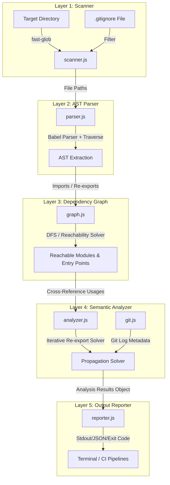

# Orphix: Developer-Level Technical Specification and Architecture Manual 🕵️‍♂️

This document serves as the absolute reference guide for developers seeking to maintain, extend, or contribute to **Orphix**. It explains the software architecture, AST parsing mechanics, graph algorithms, and data schemas in deep technical detail.

---

## 1. Product Positioning & Value Proposition

While there are several tools in the JavaScript static analysis space, Orphix occupies a unique niche. It focuses not just on *finding* dead code, but on the developer's experience of *cleaning* it up.

### Competitor Comparison Matrix

| Tool | Focus Area | What it Finds | Git-Aware? | Risk Scoring? | Explainability? |
| :--- | :--- | :--- | :--- | :--- | :--- |
| **Orphix** | Dead Code & Cleanups | Unused files, exports, functions, imports, APIs | **Yes** | **Yes** | **Yes (reasons & metrics)** |
| **Knip** | Workspace Dependencies | Unused files, exports, npm packages | No | No | No (lists names only) |
| **depcheck** | npm Packages | Unused package dependencies | No | No | No |
| **ts-prune** | TypeScript Exports | Unused exports in TypeScript | No | No | No |
| **Madge** | Visual Graphs | Circular dependencies, import graphs | No | No | No |
| **ESLint** | Code Linting | Unused variables, unused local imports | No | No | No |

### Key Differentiators of Orphix

#### 1. Explainability
Most tools print list names (e.g. `src/utils/email.js`). Orphix provides context-rich warnings:
- *Why is it flagged?* (e.g. "No incoming imports found").
- *When was it last touched?* (e.g. "Last modified 214 days ago").
- *How safe is it to delete?* (e.g. "Delete Confidence: 99%").

#### 2. Git-Aware Analysis (`--git`)
Orphix interfaces with standard Git commands to check commit history, giving engineers insight into whether a flagged file is legacy code from 8 months ago or a newly created file currently in development.

#### 3. Dead Code Risk Scoring (Delete Confidence Score)
Instead of treating all unused code with equal severity, Orphix calculates a weighted confidence score. This factors in:
- Module connectivity (inbound/outbound edges).
- Git activity (commit timelines).
- Local usage references (distinguishing between fully dead functions vs exports used locally).

#### 4. Developer-Friendly Reporting
Orphix outputs premium colorized console logs, JSON arrays for custom tool integrations, and supports HTML reports showing dependency graphs, dead file listings, and risk scores.

---

## 2. System Architecture & Data Flow

Orphix operates as a unidirectional data transformation pipeline. Data flows from raw directory paths and git history to final reports.



---

## 3. Codebase Directory Map

```text
orphix/
├── bin/
│   └── cli.js            # CLI commands and configuration parsing
├── src/
│   ├── scanner.js        # File discovery and gitignore integration
│   ├── parser.js         # Babel AST generation and metadata extraction
│   ├── graph.js          # Path resolution and reachability analysis
│   ├── analyzer.js       # Core logic, re-export propagation, and scoring
│   ├── git.js            # Git commit metadata helper
│   └── reporter.js       # Visually premium picocolors console reporter
├── tests/
│   ├── fixtures/         # Mock projects (standard, Next.js, barrel)
│   └── run.js            # Programmatic verification test runner
├── README.md             # Public usage manual
└── LICENSE               # MIT License
```

---

## 4. Deep Dive into the Compiler Frontend: `src/parser.js`

Orphix processes code by parsing it into an **Abstract Syntax Tree (AST)** using `@babel/parser`. It then traverses the tree using `@babel/traverse` to extract syntax metadata.

### Compiler Configuration

To ensure modern syntax support (TypeScript, JSX, decorators), the parser is configured as follows:

```javascript
ast = parse(code, {
  sourceType: 'module',
  plugins: [
    'jsx',
    'typescript',
    ['decorators', { decoratorsBeforeExport: true }],
    'classProperties',
    'classPrivateProperties',
    'classPrivateMethods',
    'exportDefaultFrom',
    'exportNamespaceFrom',
    'dynamicImport',
  ],
});
```

### AST Traversal & Node Mappings

Orphix collects details from the AST nodes during traversal:

| Node Type | Properties Checked | Extraction Target |
| :--- | :--- | :--- |
| `ImportDeclaration` | `node.source.value`, `node.specifiers` | Source path, imported names (`specifiers`), and local variable name bindings (`localImports`). |
| `CallExpression` | `node.callee`, `node.arguments` | Detects dynamic `require('module')` statements. |
| `ImportExpression` | `node.source` | Detects dynamic `import('module')` statements. |
| `ExportDefaultDeclaration` | `node.declaration` | Default export mapping, capturing function or class name bindings. |
| `ExportNamedDeclaration` | `node.declaration`, `node.specifiers`, `node.source` | Named exports, destructured variable names, and named re-exports (barrel configurations). |
| `ExportAllDeclaration` | `node.source` | Wildcard re-exports (`export * from 'module'`). |
| `FunctionDeclaration` | `node.id.name` | Local function definitions. |
| `ClassDeclaration` | `node.id.name` | Local class component definitions. |
| `VariableDeclarator` | `node.id.name`, `node.init.type` | Function expressions, arrow functions, and memoized HOCs (`React.memo`). |
| `Identifier` | `pathNode.isReferencedIdentifier()` | Tracks variable uses in scope. |
| `JSXIdentifier` | `node.name` | Tracks React component tags (e.g., `<Button />`). |
| `StringLiteral` / `TemplateLiteral` | `node.value`, `node.quasis` | Extracted strings used for checking API endpoints. |

### Data Structures Returned by Parser
```typescript
interface ParsedFile {
  imports: Array<{
    source: string;
    specifiers: string[];
    localImports?: Array<{ localName: string; importedName: string }>;
    reexportMap?: Record<string, string>;
    isNamespace: boolean;
    isReexport?: boolean;
  }>;
  exports: Array<{
    name: string;
    isDefault: boolean;
    line: number;
  }>;
  localFunctions: Array<{
    name: string;
    line: number;
    isReactComponent: boolean;
  }>;
  referencedNames: string[];
  exportedNames: string[];
  stringLiterals: string[];
}
```

---

## 5. Graph Solver & Path Resolution: `src/graph.js`

The Resolver translates relative path strings (like `../../components/Button`) into absolute files on the disk, resolving omissions and folder indexes.

```
                    ┌─────────────────────────┐
                    │ Resolve "../../Button"  │
                    └────────────┬────────────┘
                                 │
                   Does "../../Button" exist?
                                ├─── [Yes] ──> Returns absolute file path
                                │
                               └─── [No] ──┐
                                           │
                        Check extensions: .js, .jsx, .ts, .tsx...
                                           ├─── [Found] ──> Returns absolute file path
                                           │
                                          └─── [Not Found] ──┐
                                                             │
                                              Check directory index files
                                                             ├─── [Found] ──> Returns index absolute file path
                                                             │
                                                            └─── [Not Found] ──> Returns null (External / Unresolved)
```

### Depth-First Search (DFS) Reachability
Orphix traverses the graph from the identified entry points:
$$\text{Reachable} = \emptyset$$
$$\text{Queue} = [\text{Entry Points}]$$
$$\text{While } \text{Queue is not empty}:$$
$$u \leftarrow \text{Queue.dequeue()}$$
$$\text{If } u \notin \text{Reachable}:$$
$$\text{Reachable} \leftarrow \text{Reachable} \cup \{u\}$$
$$\text{For each child } v \text{ of } u \text{ in dependency graph}:$$
$$\text{Queue.enqueue}(v)$$

---

## 6. Usage Solver: `src/analyzer.js`

To handle re-exports through barrel files (e.g. exporting from `index.js`), Orphix executes an iterative usage propagation solver.

### The Propagation Algorithm
1. Mark all exports of entry points as **used**.
2. Mark all directly imported exports as **used**.
3. Run the solver loop:

```javascript
let changed = true;
while (changed) {
  changed = false;
  for (const file of files) {
    const fileData = parsedFiles[file];
    if (!fileData) continue;

    for (const imp of fileData.imports) {
      if (imp.isReexport) {
        const resolved = resolveImport(file, imp.source);
        if (resolved && usedExportsMap[resolved]) {
          if (imp.isNamespace) {
            // Wildcard re-export: export * from './module'
            const resolvedData = parsedFiles[resolved];
            if (resolvedData) {
              for (const exp of resolvedData.exports) {
                if (usedExportsMap[file].has(exp.name)) {
                  if (!usedExportsMap[resolved].has(exp.name)) {
                    usedExportsMap[resolved].add(exp.name);
                    changed = true;
                  }
                }
              }
            }
          } else {
            // Named re-export: export { x as y } from './module'
            if (imp.reexportMap) {
              for (const [exportedName, localName] of Object.entries(imp.reexportMap)) {
                if (usedExportsMap[file].has(exportedName)) {
                  if (!usedExportsMap[resolved].has(localName)) {
                    usedExportsMap[resolved].add(localName);
                    changed = true;
                  }
                }
              }
            }
          }
        }
      }
    }
  }
}
```

---

## 7. Delete Confidence Scoring Logic

Orphix calculates a **Delete Confidence Score** ($C$) to signal the risk level of removing a code segment:

$$\text{Confidence Score } (C) \in [0, 99]$$

### Scoring Reference Table

| Code Item Type | Condition | Confidence | Description |
| :--- | :--- | :--- | :--- |
| **Unused File** | Completely Isolated (0 imports/exports) | **99%** | The file has no incoming/outgoing hooks; deleting it is 100% safe. |
| **Unused File** | Has Dependencies (imports others) | **90%** | Safe to delete, but will leave its dependencies as new unused modules. |
| **Unused File** | Old File (+ Git Integration) | **+5%** | Adds 5% to confidence (up to 99% max) if the file has not been committed for >180 days. |
| **Unused Export** | No Local References | **99%** | Safe to remove the entire exported declaration. |
| **Unused Export** | Has Local References | **85%** | Remove the `export` keyword only. The function is still called internally in the file. |
| **Unused Function** | Private Function (not exported) | **99%** | Private function is completely dead inside the file scope. |
| **Unused Function** | Exported Function | **95%** | Safe to remove because both the export and local call counts are zero. |
| **Unused Import** | Unused local binding | **99%** | Safe to strip from the imports block. |
| **Dead API Route** | Unreferenced API file | **90%** | No client-side code fetches this path, but could be called externally. |

---

## 8. Future Additions: Developer Implementation Blueprints

If you want to contribute or make Orphix even better, here are features that can be added:

### A. Automatic Code Cleanup (Codemod)
You can add a command that rewrites the files to strip out unused code. Here is a blueprint of how the cleanup code would look using Babel:

```javascript
import fs from 'fs';
import { parse } from '@babel/parser';
import traverseModule from '@babel/traverse';
import generateModule from '@babel/generator';

const traverse = traverseModule.default || traverseModule;
const generate = generateModule.default || generateModule;

export function cleanFileUnusedImports(filePath, unusedImportNames = []) {
  const code = fs.readFileSync(filePath, 'utf-8');
  const ast = parse(code, { sourceType: 'module', plugins: ['jsx', 'typescript'] });

  traverse(ast, {
    ImportDeclaration(pathNode) {
      // Filter out specifiers that are flagged as unused
      pathNode.node.specifiers = pathNode.node.specifiers.filter(spec => {
        return !unusedImportNames.includes(spec.local.name);
      });

      // If no specifiers are left, remove the entire import statement
      if (pathNode.node.specifiers.length === 0) {
        pathNode.remove();
      }
    }
  });

  const cleanedCode = generate(ast, {}, code).code;
  fs.writeFileSync(filePath, cleanedCode, 'utf-8');
}
```

### B. Monorepo Workspace Resolver
To support monorepos (where imports link to other local packages inside a single repository), you can resolve paths by reading `package.json` workspaces:

```javascript
import path from 'path';
import fs from 'fs';

export function resolveMonorepoImport(source, monorepoRootDir) {
  // 1. Read workspaces from root package.json
  const rootPkg = JSON.parse(fs.readFileSync(path.join(monorepoRootDir, 'package.json'), 'utf-8'));
  const workspaces = rootPkg.workspaces || [];
  
  // 2. Scan workspace folders for package names
  // In a real implementation, you would index workspace package.json names
  // and map them to their directories, e.g.:
  // { "@myproject/shared": "/absolute/path/to/shared/src/index.ts" }
  
  const packageMap = {}; // Maps package name to entry point file
  
  if (packageMap[source]) {
    return packageMap[source]; // Return resolved absolute path
  }
  
  return null; // Fallback to normal resolution
}
```
